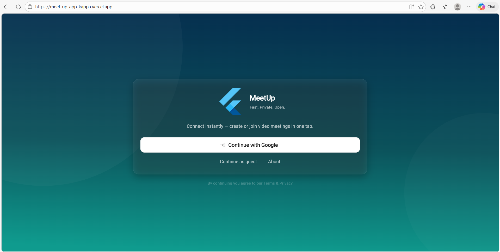
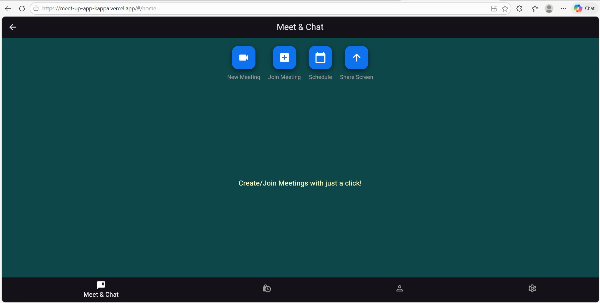
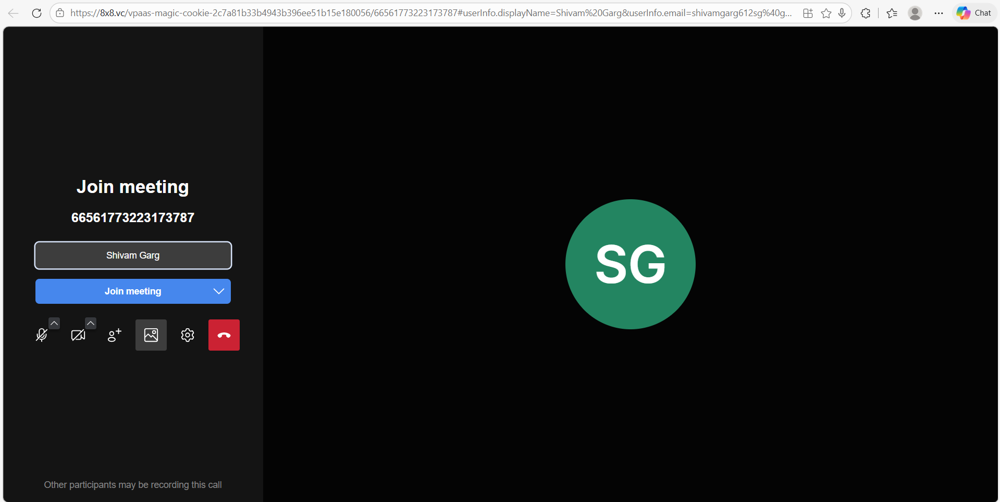
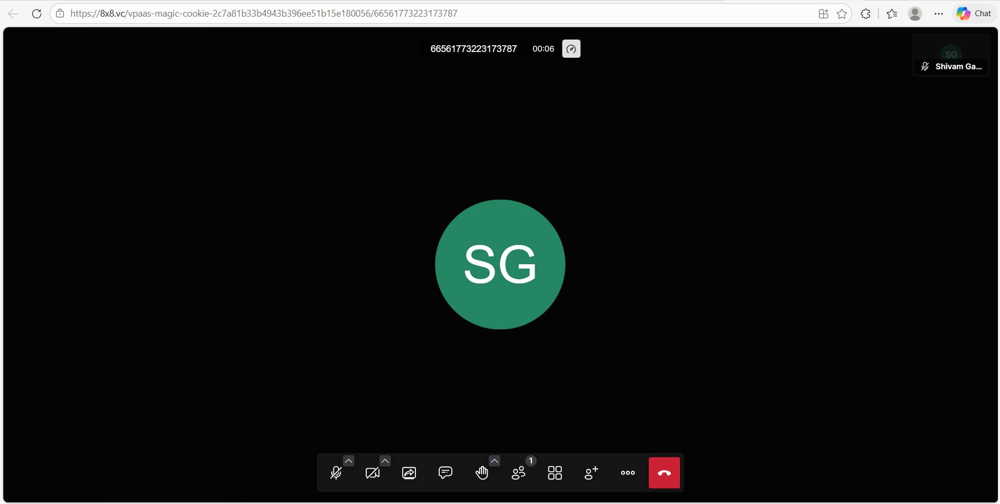

# Meetup App — event meetups that actually get people to show up

A simple, polished Flutter app for creating, discovering and joining local meetups — built to help students and young professionals overcome social hesitation and actually attend events.

---

## Key highlights
- Lightweight UI with fast flows: create an event in < 30s, join in 2 taps.  
- Google sign-in + cloud persistence so users keep coming back.  
- Built as a campus/community-first project — great to show interviewers who care about impact.

---

## Features
- Sign in with Google
- Create, edit and delete meetups
- Browse upcoming events and join them
- Organizers can see attendee list
- Cloud-backed (sync across devices)
- Clean, mobile-first UI designed for quick discovery

---

## Tech stack & tools
Built with:
- :contentReference[oaicite:0]{index=0} — UI & app framework  
- :contentReference[oaicite:1]{index=1} — Auth + Firestore  
- :contentReference[oaicite:2]{index=2} — authentication  
Development: :contentReference[oaicite:3]{index=3}, Git and deployment on :contentReference[oaicite:4]{index=4}.

---

## Screenshots

| Login | Event list | Create event | Inside meeting |
|---:|:---:|:---:|:---:|
|  |  |  |  |

---

## Quick start

```bash
# clone
git clone https://github.com/Shivamgargdtu/meetup-project.git
cd meetup-project

# install
flutter pub get

# run on device / emulator
flutter run
